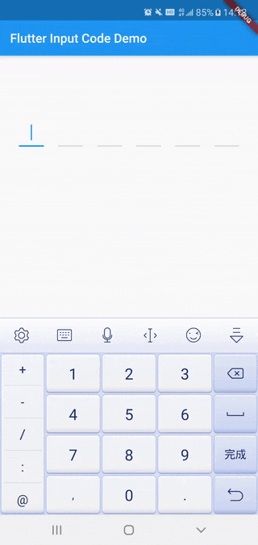

# verify_code_input

A verification code input widget.

## Showcase



## Usage

```dart
VerifyCodeInput(
    onComplete: (String value) {
       print('Your input code is : $value');
    },
)
```

